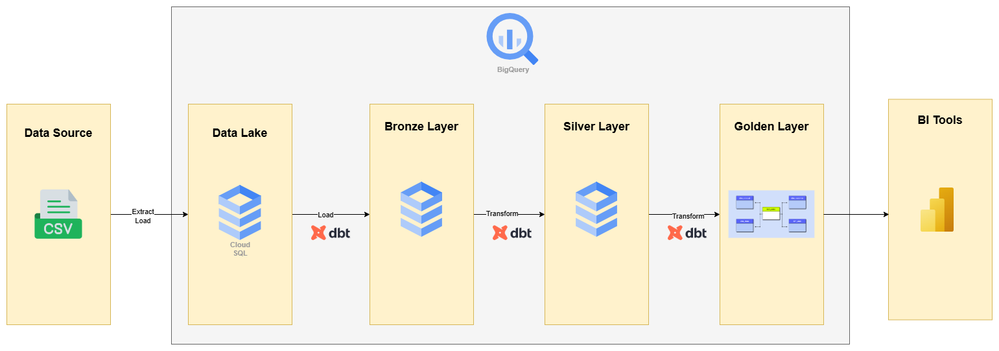
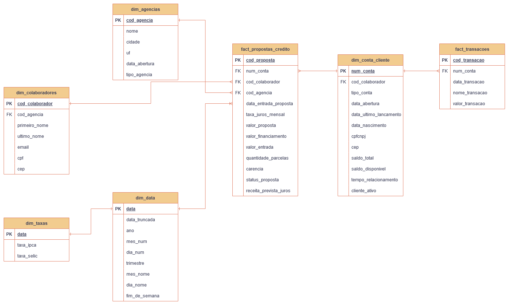
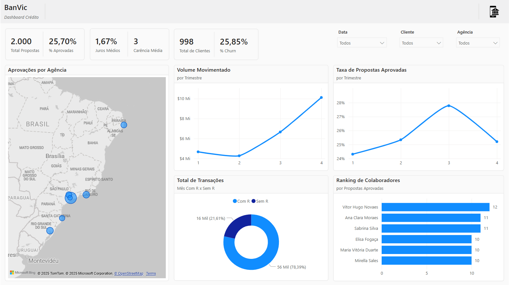

# Desafio Analytics Engineering Indicium Lighthouse - Case Banco Vitória


## 📌 Introdução
Este projeto trata da resolução do case **BanVic - A Jornada dos Dados Financeiros**. O desafio girou em torno da implementação de um Data Warehouse e resolução de algumas demandas feitas pela equipe do BanVic.

1. Realizar uma análise exploratória e mostrar o valor do dados, trazendo respostas a perguntas de negócio.
2. Identificar os indicadores que se adequam a pergunta anterior.
3. Criar uma dim_dates no Data Warehouse, e responder algumas questões:
    - Qual trimestres tem maior número de transações aprovadas, e volume movimentado em média?
    - Um analista sugeriu que meses que tem R no nome, tem maior número de transações. Apresente sua análise para essa questão.
4. Trazer dados público para o DW que possam ampliar a análise, e mostrar como eles enriquecer a base de dados. 

## 🛠️ Ferrametnas utilizadas
- Python 3.12^
    - dbt-core
    - dbt-bigquery
    - Pandas
    - Openpyxl
- Google BigQuery
- Microsoft Power BI

## ✅ Resultados

### Modelagem de Dados



#### Bronze Layer
- Ingestão dos dados brutos em seu formato orignal.

#### Silver Layer
- Dados transformados, limpos e enriquecidos.  

#### Golden Layer
- Dados *business-ready*, agregados e otimizados para o consumo em ferramentas de BI. Foi criado o Data Mart Comercial para criação de relatórios relacionados às demandas. 





## ⚙️ Instalação e uso

Dashboard interativo no [Power BI Service](https://app.powerbi.com/view?r=eyJrIjoiZjJmMmIwNjgtM2FiMi00NjA4LThmNTctOTU5NDcxZmMwODkwIiwidCI6ImJmOWUzNDgwLTkyM2UtNDNmMS04OTE1LTlmMmY3YjY2NTc0MSJ9). 

Relatório final na pasta [doc/](doc).

##### Instalação do poetry
```bash
pip install poetry
```

##### Clonar repostório e instalar dependências
```bash
git clone https://github.com/datalopes1/ea_lh.git
cd ea_lh
poetry install
```

##### Converter dados .xlsx para .csv em formato ajustado
```bash
python scr/main.py
```

##### Ativar modelos do dbt
```bash
dbt run
```

###### Fazer testes com dbt
```bash
dbt test
```

## 📞 Contato
- LinkedIn: https://www.linkedin.com/in/andreluizls1
- Portfolio: https://sites.google.com/view/datalopes1
- E-mail: datalopes1@proton.me